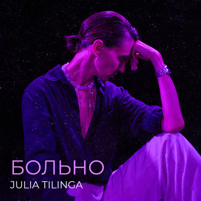

# Больно

## Стиль произведения

Это глубоко эмоциональный и кинематографичный сингл в жанре альт-поп, рассказывающий историю безответной любви и внутреннего сопротивления. Женщина с искренней надеждой тянется к мужчине, ощущая между ними мощную связь, но в ответ получает холод и закрытость — он «волк», выбирающий одиночество вместо любви

Текст песни разворачивается как диалог — как короткий эмоциональный фильм. Уязвимость героини, его отстранённость и контраст между ними создают медленное, болезненное напряжение. Несмотря на отказ, она продолжает пытаться достучаться — и в один хрупкий момент он чуть открывается, чтобы снова закрыться

Продакшн минималистичный и атмосферный: мягкие синты и вокал в центре внимания позволяют словам и паузам между ними звучать особенно сильно

**Язык:** Русский 
**Жанр:** Альтернативный поп / грустный поп  
**Настроение:** Эмоциональное, уязвимое, кинематографичное  
**Звучание:** Интимно, повествовательно, меланхолично  
**Инструменты:** Эмбиентные синты, лёгкая перкуссия, акцент на вокале  
**Похожие артисты:** Lana Del Rey, Billie Eilish, AURORA, Florence + The Machine  

## Слова песни

В день, когда увидела тебя я  
Сердцем ощутила нашу связь  
И билось оно громко расцветая  
И тихо проживало эту страсть  

Вдруг у нас получится просто дружить  
Ведь мы можем быть вместе счастливы  
(вместе счастливы)  
Давай попробуем вдвоём с тобою быть  
Несмотря на то, что мы такие разные  

Очень больно, когда невзаимно  
Когда сердце зовёт, но бессильно  
Ты так близко, но чужой  
Рвётся моя душа за тобой  

(а он ответил)  
Что ты детка говоришь такое  
Вообще не понимаю ничего я  
Никого не жду я в гости  
И не нужно ко мне приходить  

Я волк-одиночка  
(слышишь)  
Что хочешь от меня ты  
(что ты хочешь)  
Вот моя нора, в ней живу я  
Здесь мои правила, здесь моя игра  

Очень больно, когда невзаимно  
(невзаимно)  
Когда сердце зовёт, но бессильно  
(бессильно)  
Ты так близко, но чужой  
(чужой)  
Рвётся моя душа за тобой  

Ах, я не знаю, что теперь мне делать  
(делать)  
Давай с тобой попробуем гулять  
И будем этим миром наслаждаться  
(да)  
Ведь море, звёзды, солнце — благодать  

(и тогда он сказал)  
Ну садись со мной рядом  
И давай поболтаем  
Расскажи свои мысли  
(мысли)  
Что ты в сердце скрываешь  

Больно  
Бо-ольно  
Бо-о-ольно  
♪  
Как же бо-о-ольно  

Что такое говоришь ты  
(говоришь ты)  
Ничего не понимаю  
Без тебя живу давно здесь  
(давно)  
Одиночество не угнетает  

Я волк-одиночка  
А ты хочешь спасти  
Я один в этом мире  
Мне не нужно любви  